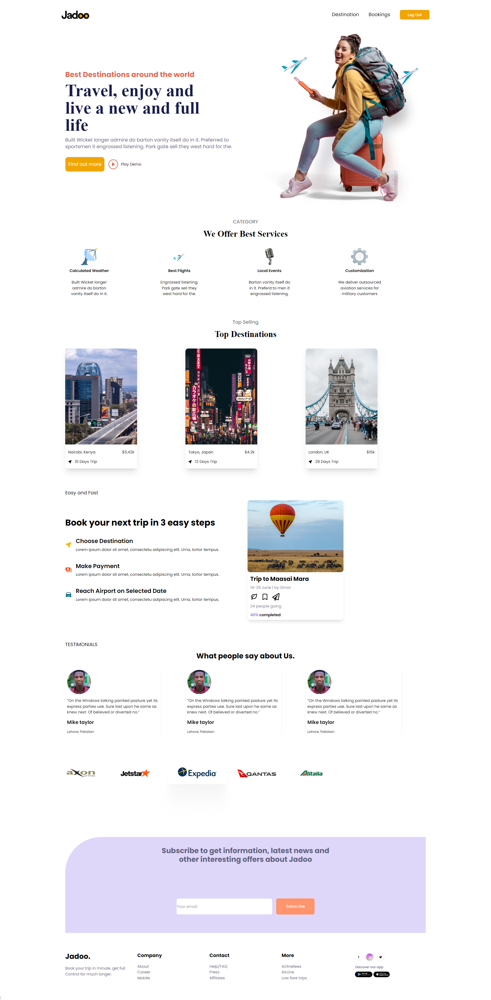

# TravelNext

## Description

TravelNext is a comprehensive website that allows users to easily book travel tickets and accommodations for destinations all around the world. With TravelNext, you can easily book airfare to your dream destination, as well as bus tickets and hotels from various places in the world. Whether you're looking for a weekend getaway or planning the trip of a lifetime, TravelNext makes it convenient and hassle-free to book all aspects of your travel itinerary in one place. Say goodbye to scouring multiple websites or spending hours on the phone with customer service, and hello to TravelNext - your one-stop-shop for all your travel needs!

🌍 This is the source code for the TravelNext website. The website is built with the following tech stacks:

- [x] Next.js
- [x] NextAuth
- [x] Typescript
- [x] RestApi

## Getting Started

To run this project locally, follow these instructions:

1. Clone this repository.
2. Install the dependencies using `npm install`.
3. Start the development server using `npm run dev`.
4. Open [http://localhost:3000](http://localhost:3000) in your browser.

## Contributing

If you want to contribute to this project, please follow these guidelines:

1. Fork this repository.
2. Create a new branch.
3. Make your changes and commit them.
4. Push your changes to your forked repository.
5. Submit a pull request to this repository.

## License

This project is licensed under the MIT License - see the [LICENSE](LICENSE) file for details.

---
